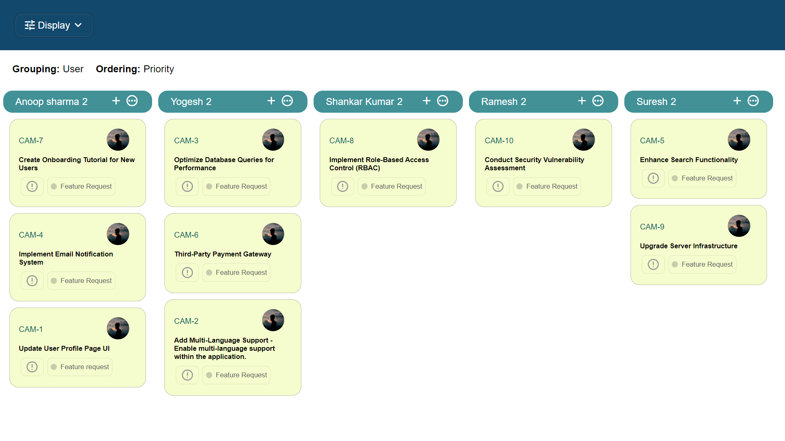

# 📝 Kanban Board ✅
## Abstract
A Kanban board is a visual tool used for managing and representing work in progress. It is a popular method in project management and software development for visualizing tasks, their status, and the flow of work through different stages. The term "Kanban" comes from Japanese and translates to "visual signal" or "card."

The Kanban board typically consists of a board with columns representing different stages of a workflow, and each task or work item is represented by a card that moves through these columns as it progresses. The columns on a typical Kanban board might include stages such as "To Do," "In Progress," "Testing," and "Done," but the columns can be customized to fit the specific workflow of a team or project.

### STEPS TO SETUP LOCAL BUILD OF FRONTEND:

 
1. Clone the project from github link provided.
2. After this step , Just run one command `npm install` in the terminal opened in the same directory where the project exists.This command will basically install all the dependencies on local.
3. Run the command : `npm start` -> It will start react server on local.
4. Server is running on port 3000.
5. Open the browser and type `localhost:3000` in the address bar.

## Author

## Screenshots

